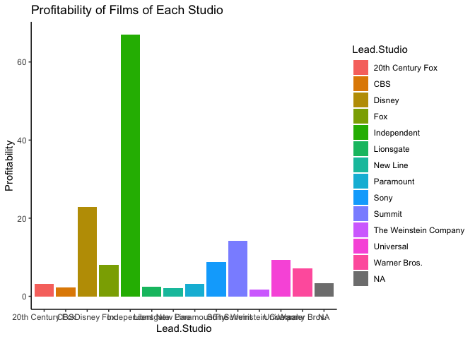

Question 1 Answer: Movies
================
20903936
24/05/2021

\#Introduction

This report will aim to test three theories which were discussed around
a braai. The theories were based on a discussion regarding claims that
movie critics. Specifically, the assertion was that movie critics are
near perfect predictors of films’ popularity and profitability among
audiences. This informal letter will briefly show whether this is not
true or not by address theories our dear friend made.

\#The Data

The data seems to fine. Variables have their correct specifications. As
can be noted, there are 8 variables and 74 observations.

``` r
glimpse(my_data)
```

    ## Rows: 74
    ## Columns: 8
    ## $ Film              <chr> "27 Dresses", "(500) Days of Summer", "A Dangerous M…
    ## $ Genre             <chr> "Comedy", "Comedy", "Drama", "Drama", "Romance", "Co…
    ## $ Lead.Studio       <chr> "Fox", "Fox", "Independent", "Universal", "Independe…
    ## $ Audience..score.. <int> 71, 81, 89, 64, 84, 80, 66, 80, 51, 52, 47, 52, 56, …
    ## $ Profitability     <dbl> 5.3436218, 8.0960000, 0.4486447, 4.3828571, 0.652603…
    ## $ Rotten.Tomatoes.. <int> 40, 87, 79, 89, 54, 84, 29, 93, 40, 26, 27, 56, 53, …
    ## $ Worldwide.Gross   <dbl> 160.308654, 60.720000, 8.972895, 30.680000, 29.36714…
    ## $ Year              <int> 2008, 2009, 2011, 2009, 2007, 2011, 2010, 2007, 2008…

\#Theory 1

The first theory that our friend suggested was that she firmly remembers
that Rotten Tomatoes was always a great review platform. And if a movie
had a rating of more than 80% on Rotten Tomatoes, audiences would rate
it above 85% every time.

``` r
#Renaming the variables 

my_data <- my_data %>% rename(Audience.Score = Audience..score.., Rotten.Tomatoes = Rotten.Tomatoes..)

above_80 <- my_data %>% filter(Rotten.Tomatoes > 80) %>% select(Film,Audience.Score,Rotten.Tomatoes)

print(above_80)
```

As can be seen above, where the Rotten Tomatoes had an above 80 rating,
the Audience ratings were not above 85% all the time.

\#Theory 2

Our dear friend further suggested that Disney Flims may not have had the
highest grossing numbers,however they’ve always been the most profitable
of all the leading studios.

    ## Warning: Removed 3 rows containing missing values (geom_bar).

<!-- -->

\#Theory 3

The third assertion made by our dear friend is that audiences are always
drawn to the highest grossing Films. In fact she says claims that “the
correlation between the world wide grossing numbers and audience scores
would be near 80%.”

``` r
#if(!require(devtools)) install.packages("devtools")
#library("devtools")

my_data <- my_data %>% rename(Audience.Score = Audience..score.., Rotten.Tomatoes = Rotten.Tomatoes..)

correlation <- cor.test(my_data$Worldwide.Gross,my_data 
                        $Audience.Score..,method="pearson")
correlation 
```

\#Conclusion

It is clear that our friend is misguided. That data clearly shows that
her theory ascertions are not ture.
